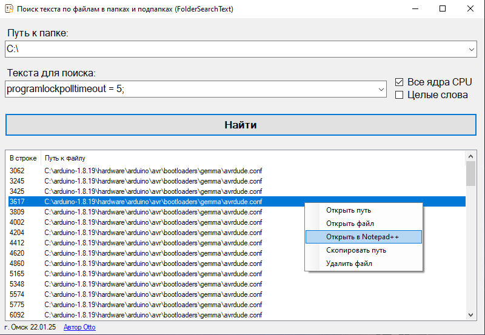

**FolderSearchText** - Программа для поиска текста по файлам в папках и подпапках.

Программа заточена под быстрый поиск искомого текста в  в текстовых файлах, которые могут находиться в разных подпапках по заданному пути.

Используется _.NET Framework 4.8_

Версия языка C#: _12.0_

_Проект полностью открыт и распространяется по лицензии MIT._

Ссылки на [GitHub](https://github.com/Otto17/FolderSearchText) и [GitFlic](https://gitflic.ru/project/otto/foldersearchtext).

---

**Пример использования:**

_Хочу найти в каких библиотеках из сотен файлов и подпапок используются шрифты с расширением “.woff2” (для языка программирования Go), указываю его как текст для поиска._

_Знаю, что искать нужно по пути “C:\\Users\\Gusi\\go”, указываю этот путь и жму “Найти”._

---

**Возможности:**

*   Программа запоминает историю из последних 20 путей и искомых слов в выпадающем списке. История хранится в файле “history\_FolderSearchText.txt” во временных файлах пользователя “%LocalAppData%/Temp”.
*   Поиск в многоядерном или одноядерном режиме (для слабых ПК).
*   Поиск целых слов, либо поиск подстроки (поиск без учета целых слов).
*   Контекстное меню в поле для найденных результатов:
    
    \- "Открыть путь" - открывает папку и выделяет найденный файл (используется так же по умолчанию при двойном клике на файл);
    
    \- "Открыть файл" - открывает файл в программе, которая по умолчанию назначена для данного расширения;
    
    \- "Открыть в Notepad++" - открывает файл принудительно в Notepad++, при условии, что он установлен в системе (иначе этот пункт неактивен);
    
    \- "Скопировать путь" - копирует полный путь к файлу в буфер обмена (поддерживается горячая клавиша Ctrl+C);
    
    \- "Удалить файл" - удаляет файл по указанному пути (поддерживается горячая клавиша Delete).
    

---

В поле с найденными файлами присутствует 2 столбца “**В строке**” и “**Путь к файлу**”.

“**В строке**” - указывается в какой строке (сверху вниз) найдено соответствие по искомому слову.

“**Путь к файлу**” - Полный путь к найденному файлу.

---

**Автор Otto, г. Омск 2025**
